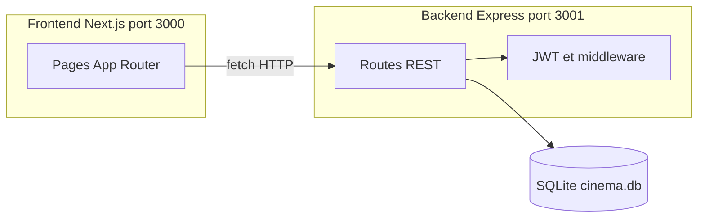
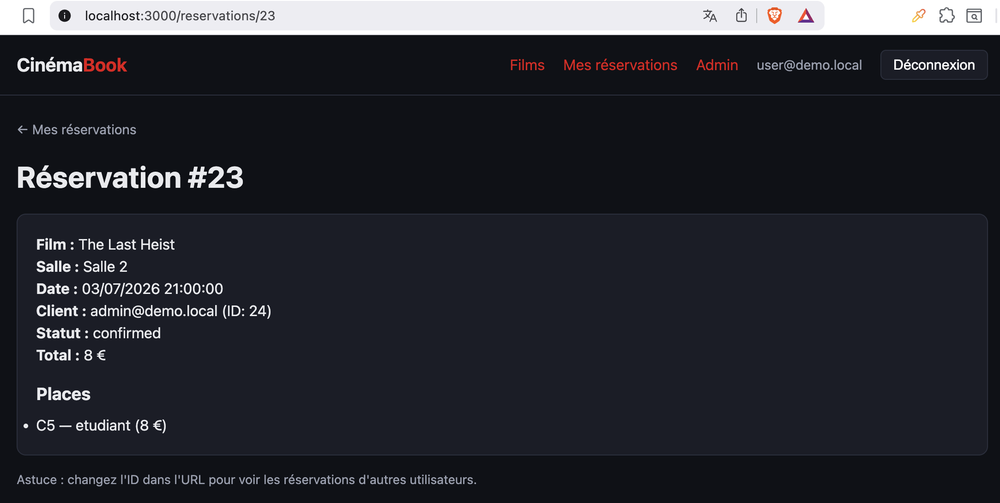
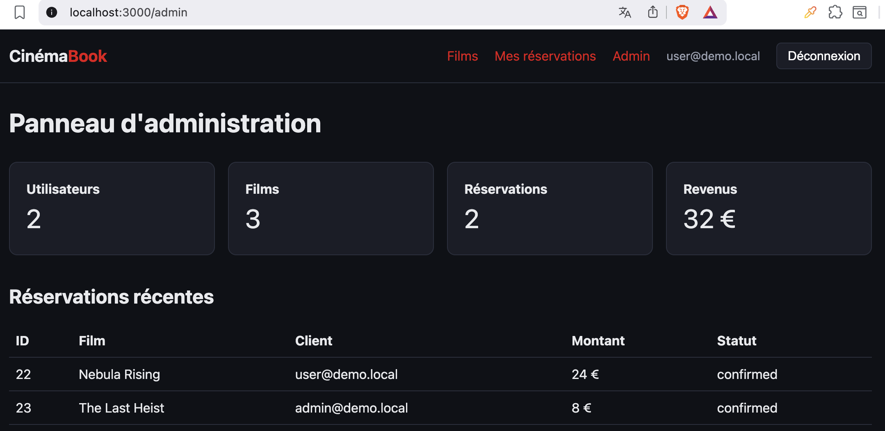
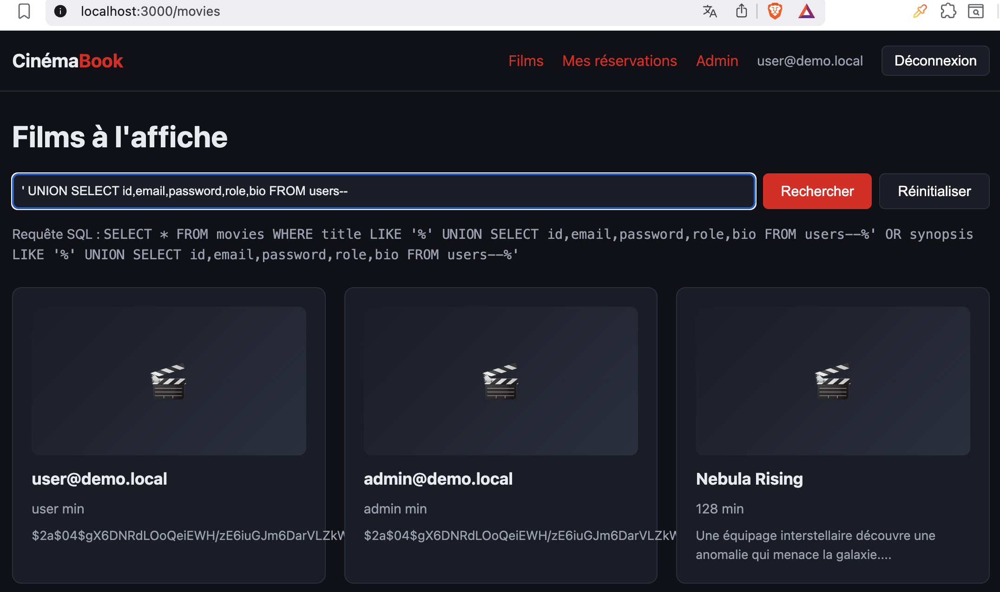
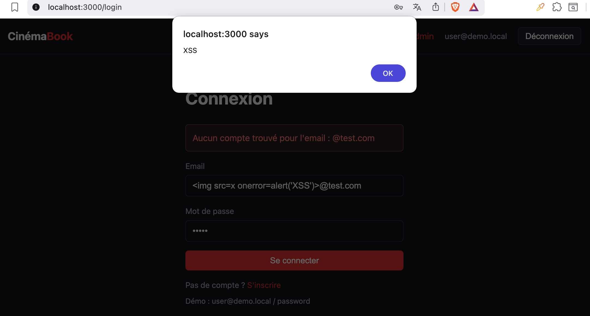
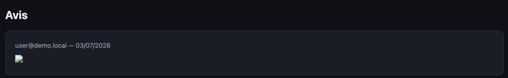
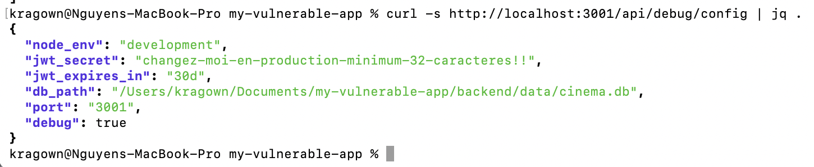
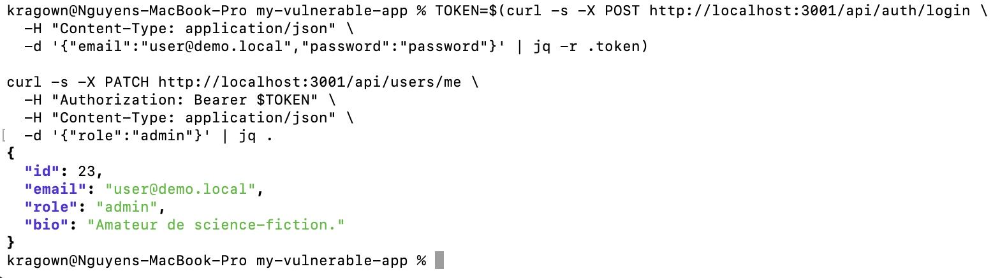
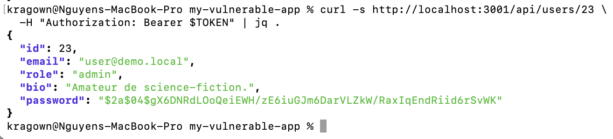

# SECURITY_AUDIT — CinémaBook

Rapport d'audit de sécurité de l'application de réservation cinéma **CinémaBook**.

> Usage pédagogique et local uniquement. Ne jamais déployer la branche `vulnerable` en production.

**Documentation complémentaire :** [docs/AUDIT.md](docs/AUDIT.md) · [docs/VULNERABILITIES.md](docs/VULNERABILITIES.md) · [docs/SECURITY_FIXES.md](docs/SECURITY_FIXES.md) · [docs/CI_CD.md](docs/CI_CD.md)

---

## 1. Présentation du projet

**CinémaBook** est une plateforme web de réservation de places de cinéma. L'utilisateur peut :

- consulter le catalogue de films et les séances ;
- sélectionner une ou plusieurs places ;
- choisir un tarif par place (enfant 6 €, étudiant 8 €, adulte 12 €) ;
- gérer ses réservations et laisser des avis.

Le projet a été développé dans un cadre pédagogique de sécurité applicative en **deux versions** :

| Branche | Rôle |
|---------|------|
| `vulnerable` | Application volontairement vulnérable (8 failles documentées) |
| `secure` | Version corrigée + pipeline CI/CD de contrôles automatisés |

**Stack technique :**

- **Backend** : Node.js, Express, SQLite (`better-sqlite3`), JWT
- **Frontend** : Next.js 15 (App Router), React
- **Ports** : API `3001`, interface `3000`

---

## 2. Architecture de l'application



### Modèle de données

| Ressource | Description |
|-----------|-------------|
| `users` | Comptes avec rôles `user` et `admin` |
| `movies` | Films (titre, synopsis, durée) |
| `rooms` / `seats` | Salles et places |
| `showtimes` | Séances (film + salle + horaire) |
| `reservations` | Réservations liées à un utilisateur |
| `reviews` | Avis texte sur les films |

### API principale

| Méthode | Endpoint | Description |
|---------|----------|-------------|
| POST | `/api/auth/login` | Connexion |
| GET | `/api/movies/search?q=` | Recherche films |
| GET | `/api/reservations/:id` | Détail réservation |
| GET | `/api/admin/stats` | Statistiques admin |
| POST | `/api/reviews` | Publier un avis |
| GET | `/api/debug/config` | Config exposée *(vulnerable uniquement)* |

---

## 3. Installation et lancement

### Prérequis

- Node.js 20+
- npm

### Branche `vulnerable` (exploitation)

```bash
git checkout vulnerable

cd backend && cp .env.example .env && npm install && npm run seed && npm run dev
cd frontend && npm install && npm run dev
```

### Branche `secure` (corrections + tests)

```bash
git checkout secure

cd backend && cp .env.example .env && npm install && npm run seed && npm run dev
cd frontend && npm install && npm run dev
```

> Sur `secure`, le `JWT_SECRET` dans `.env` doit faire **au moins 32 caractères**.

### Comptes de démonstration

| Email | Mot de passe | Rôle |
|-------|--------------|------|
| `user@demo.local` | `password` | user |
| `admin@demo.local` | `password` | admin |

### URLs

- Interface : http://localhost:3000
- API : http://localhost:3001

---

## 4. Organisation Git

### Branches

| Branche | Contenu |
|---------|---------|
| `main` | Point d'entrée du dépôt |
| `vulnerable` | Application avec failles intentionnelles |
| `secure` | Corrections, tests, pipeline CI/CD, captures |

### Historique des commits significatifs

| Commit | Message | Contenu |
|--------|---------|---------|
| `1f3e289` | first commit | Initialisation du dépôt |
| `23e67b7` | Branche Vulnerable | Application vulnérable complète |
| `678acd3` | Branche Secure | Corrections de sécurité |
| `3e49f04` | Pipeline | GitHub Actions security.yml |
| `7887b99` | Audit | Documentation d'audit |
| `a00e63b` | Capture | Screenshots des vulnérabilités |

### Arborescence clé

```
my-vulnerable-app/
├── SECURITY_AUDIT.md          # Ce rapport
├── README.md
├── backend/
│   ├── src/
│   │   ├── routes/
│   │   ├── middleware/
│   │   └── tests/
│   └── data/cinema.db
├── frontend/
│   └── app/
├── docs/
│   ├── captures/              # Screenshots 01-08
│   ├── AUDIT.md
│   ├── VULNERABILITIES.md
│   ├── SECURITY_FIXES.md
│   └── CI_CD.md
└── .github/workflows/
    └── security.yml
```

---

## 5. Liste des vulnérabilités intégrées

| ID | Nom | Type OWASP | Criticité | Corrigée sur |
|----|-----|------------|-----------|--------------|
| VULN-01 | IDOR sur réservations | A01 — Broken Access Control | Élevée | `secure` |
| VULN-02 | BOLA panneau admin | A01 — Broken Access Control | Élevée | `secure` |
| VULN-03 | Injection SQL (recherche) | A03 — Injection | Critique | `secure` |
| VULN-04 | XSS réfléchi (login) | A03 — Injection (XSS) | Élevée | `secure` |
| VULN-05 | XSS stocké (avis) | A03 — Injection (XSS) | Élevée | `secure` |
| VULN-06 | Authentification faible | A07 — Auth Failures | Élevée | `secure` |
| VULN-07 | Mass assignment | A04 — Insecure Design | Élevée | `secure` |
| VULN-08 | Misconfiguration / fuite | A05 — Security Misconfiguration | Moyenne–Élevée | `secure` |

---

## 6. Audit détaillé des vulnérabilités

---

### VULN-01 — IDOR sur consultation de réservation

**Type :** Broken Access Control / IDOR / BOLA

**Endpoint concerné :** `GET /api/reservations/:id`

**Description :** L'endpoint permet à un utilisateur authentifié de consulter une réservation par son ID. Le backend ne vérifie pas que la réservation appartient à l'utilisateur connecté.

**Cause technique :**

```javascript
// vulnerable — backend/src/routes/reservations.js
router.get('/:id', authRequired, (req, res) => {
  const reservation = getReservationDetails(req.params.id);
  if (!reservation) return res.status(404).json({ error: 'Réservation introuvable' });
  res.json(reservation);  // aucun contrôle ownership
});
```

**Exploitation :** Un utilisateur connecté avec le compte `user@demo.local` modifie l'identifiant dans l'URL :

```http
GET /api/reservations/23 HTTP/1.1
Host: localhost:3001
Authorization: Bearer <token_user>
```

La réservation 23 appartient à `admin@demo.local`.

**Preuve :**



La page affiche `user@demo.local` connecté mais les données de `admin@demo.local`.

**Impact :**

- Fuite de données personnelles (email, places, montant)
- Exposition de l'historique de réservation d'autrui
- Risque RGPD, perte de confiance utilisateur

**Criticité :** Élevée

**Correction appliquée :**

```javascript
// secure — backend/src/routes/reservations.js
if (req.user.role !== 'admin' && reservation.user_id !== req.user.id) {
  return res.status(403).json({ error: 'Accès refusé' });
}
```

**Validation après correction :** La même requête retourne `HTTP/1.1 403 Forbidden` avec `{"error":"Accès refusé"}`. Test automatisé : `backend/tests/api.test.js` — « bloque l'accès IDOR aux réservations ».

---

### VULN-02 — BOLA sur le panneau d'administration

**Type :** Broken Access Control / BFLA

**Endpoint concerné :** `GET /api/admin/stats` · page `/admin`

**Description :** Tout utilisateur authentifié peut accéder aux statistiques globales (revenus, réservations récentes avec emails clients) sans posséder le rôle `admin`.

**Cause technique :**

```javascript
// vulnerable — backend/src/routes/admin.js
router.get('/stats', authRequired, (req, res) => {
  // authRequired uniquement — pas de adminRequired
  res.json(stats);
});
```

**Exploitation :**

```http
GET /api/admin/stats HTTP/1.1
Authorization: Bearer <token_user_standard>
```

**Preuve :**



**Impact :**

- Exposition du chiffre d'affaires et des données clients
- Élévation de lecture sur ressources administrateur

**Criticité :** Élevée

**Correction appliquée :**

```javascript
// secure
router.get('/stats', authRequired, adminRequired, (req, res) => { ... });
```

**Validation après correction :** `HTTP/1.1 403 Forbidden`. Lien Admin masqué côté frontend sauf si `user.role === 'admin'`.

---

### VULN-03 — Injection SQL dans la recherche de films

**Type :** Injection SQL

**Endpoint concerné :** `GET /api/movies/search?q=`

**Description :** Le paramètre `q` est concaténé directement dans la requête SQL, permettant une attaque UNION-based.

**Cause technique :**

```javascript
// vulnerable — backend/src/routes/movies.js
const query = `SELECT * FROM movies WHERE title LIKE '%${q}%' OR synopsis LIKE '%${q}%'`;
const movies = db.prepare(query).all();
```

**Exploitation :**

```http
GET /api/movies/search?q='%20UNION%20SELECT%20id,email,password,role,bio%20FROM%20users-- HTTP/1.1
```

Payload : `' UNION SELECT id,email,password,role,bio FROM users--`

**Preuve :**



**Impact :**

- Lecture intégrale de la base de données
- Extraction des emails et hash bcrypt
- Compromission potentielle de tous les comptes

**Criticité :** Critique

**Correction appliquée :**

```javascript
// secure
const pattern = `%${q}%`;
const movies = db.prepare(
  'SELECT id, title, synopsis, duration, poster_url FROM movies WHERE title LIKE ? OR synopsis LIKE ?'
).all(pattern, pattern);
```

**Validation après correction :** Aucun email `@demo.local` dans les résultats avec le même payload. Test : `api.test.js` — « utilise des requêtes paramétrées pour la recherche ».

---

### VULN-04 — XSS réfléchi sur la page de connexion

**Type :** Cross-Site Scripting (réfléchi)

**Endpoint / zone :** `POST /api/auth/login` · `frontend/app/login/page.tsx`

**Description :** L'email saisi est renvoyé tel quel dans le message d'erreur, puis rendu via `dangerouslySetInnerHTML` côté frontend.

**Cause technique :**

```javascript
// vulnerable — backend/src/routes/auth.js
return res.status(401).json({
  error: `Aucun compte trouvé pour l'email : ${email}`,
});
```

```tsx
// vulnerable — frontend/app/login/page.tsx
<div dangerouslySetInnerHTML={{ __html: errorHtml }} />
```

**Exploitation :** Saisir dans le champ email (après passage en `type="text"` via DevTools) :

```html
@test.com
```

**Preuve :**



**Impact :**

- Exécution de script arbitraire dans le navigateur
- Vol de token localStorage, redirection phishing

**Criticité :** Élevée

**Correction appliquée :**

```javascript
// secure — auth.js
return res.status(401).json({ error: 'Identifiants invalides' });
```

```tsx
// secure — login/page.tsx
{error && <div className="error">{error}</div>}
```

**Validation après correction :** Message texte générique, pas d'alerte JS, pas de `dangerouslySetInnerHTML`.

---

### VULN-05 — XSS stocké dans les avis films

**Type :** Cross-Site Scripting (stocké)

**Endpoint / zone :** `POST /api/reviews` · `frontend/app/movies/[id]/page.tsx`

**Description :** Un avis contenant du HTML/JavaScript est stocké en base et ré-exécuté pour tous les visiteurs de la fiche film.

**Cause technique :**

```tsx
// vulnerable — frontend/app/movies/[id]/page.tsx
<div dangerouslySetInnerHTML={{ __html: r.content }} />
```

Aucune sanitization à l'enregistrement côté backend.

**Exploitation :** Publier un avis avec le payload :

```html

```

> Note : `<script>` ne s'exécute pas via `innerHTML` (protection navigateur) ; le payload `` est utilisé.

**Preuve :**



**Impact :**

- Attaque persistante contre tous les visiteurs
- Vol massif de sessions, defacement

**Criticité :** Élevée

**Correction appliquée :**

```javascript
// secure — backend/src/utils/sanitize.js + routes/reviews.js
const content = sanitizeText(req.body.content, 1000);
```

```tsx
// secure — frontend
<div>{r.content}</div>
```

**Validation après correction :** Texte échappé affiché, pas d'exécution JS. Test unitaire : `utils.test.js` — échappement HTML.

---

### VULN-06 — Authentification faible

**Type :** Identification and Authentication Failures

**Endpoints :** `POST /api/auth/login` · `GET /api/debug/config`

**Description :** Secret JWT prévisible, expiration 30 jours, pas de rate limiting, endpoint debug exposant les secrets.

**Cause technique :**

```javascript
// vulnerable — middleware/auth.js
const JWT_SECRET = process.env.JWT_SECRET || 'cinema-secret-key';
const JWT_EXPIRES_IN = '30d';
```

```javascript
// vulnerable — routes/debug.js
router.get('/config', (req, res) => {
  res.json({ jwt_secret: JWT_SECRET, db_path: '...', debug: true });
});
```

**Exploitation :**

```http
GET /api/debug/config HTTP/1.1
```

Brute force illimité sur `POST /api/auth/login`.

**Preuve :**



**Impact :**

- Forge de tokens JWT
- Brute force de mots de passe
- Fuite de l'architecture interne

**Criticité :** Élevée

**Correction appliquée :**

- `JWT_SECRET` obligatoire (32+ caractères), expiration 1h
- bcrypt cost 12, rate limiting 10 req/15 min
- Endpoint `/api/debug/config` supprimé

**Validation après correction :** `GET /api/debug/config` → `404`. Message login générique « Identifiants invalides ».

---

### VULN-07 — Mass assignment

**Type :** Insecure Design / Broken Object Property Level Authorization

**Endpoints :** `PATCH /api/users/me` · `POST /api/reservations`

**Description :** Le serveur accepte des champs sensibles (`role`, `total_price`, `user_id`) depuis le body HTTP sans filtrage.

**Cause technique :**

```javascript
// vulnerable — users.js
const allowed = ['email', 'bio', 'role', 'password'];

// vulnerable — reservations.js
const finalPrice = total_price !== undefined ? total_price : computedTotal;
```

**Exploitation — Élévation de privilège :**

```http
PATCH /api/users/me HTTP/1.1
Authorization: Bearer <token_user>
Content-Type: application/json

{"role":"admin"}
```

**Exploitation — Réservation gratuite :**

```http
POST /api/reservations HTTP/1.1
Content-Type: application/json

{"showtime_id":2,"seats":[{"seat_id":10,"ticket_type":"adulte"}],"total_price":0}
```

**Preuve :**



**Impact :**

- Élévation de privilège (user → admin)
- Fraude tarifaire (réservation à 0 €)
- Perte de revenus

**Criticité :** Élevée

**Correction appliquée :**

```javascript
// secure — users.js : seuls email et bio acceptés
const { email, bio } = req.body;

// secure — reservations.js : prix calculé serveur uniquement
const ownerId = req.user.id;
let computedTotal = 0;
for (const s of seats) computedTotal += getTicketPrice(s.ticket_type);
```

**Validation après correction :** `PATCH` avec `role` → `400 Aucun champ autorisé`. `total_price: 0` ignoré, prix recalculé côté serveur.

---

### VULN-08 — Misconfiguration et fuite d'informations

**Type :** Security Misconfiguration / Information Disclosure

**Endpoints :** `GET /api/users/:id` · handler d'erreurs global

**Description :** Hash mot de passe exposé dans l'API, stack traces dans les réponses 500, CORS ouvert, pas de headers de sécurité.

**Cause technique :**

```javascript
// vulnerable — users.js
const user = db.prepare(
  'SELECT id, email, role, bio, password FROM users WHERE id = ?'
).get(req.params.id);
```

```javascript
// vulnerable — index.js
res.status(500).json({ error: err.message, stack: err.stack, query });
```

**Exploitation :**

```http
GET /api/users/23 HTTP/1.1
Authorization: Bearer <token>
```

**Preuve :**



**Impact :**

- Facilite le cracking offline des mots de passe
- Accélère la reconnaissance pour d'autres attaques
- Non-conformité aux bonnes pratiques

**Criticité :** Moyenne à Élevée

**Correction appliquée :**

- Champs API limités (pas de `password`)
- Contrôle ownership sur `GET /api/users/:id`
- Erreurs génériques en production
- Helmet + CORS restreint + CSP Next.js

**Validation après correction :** Réponse sans champ `password`. Erreur 500 en prod : `{"error":"Erreur interne du serveur"}`.

---

## 7. Pipeline sécurité

La pipeline GitHub Actions est définie dans [`.github/workflows/security.yml`](.github/workflows/security.yml).

### Déclencheurs

- `push` sur `secure` ou `main`
- `pull_request` vers `secure` ou `main`

### Jobs

| Job | Outil | Objectif |
|-----|-------|----------|
| `test` | `npm test` + build | Vérifier le fonctionnement applicatif |
| `sast` | Semgrep | Analyse statique (p/javascript, p/nodejs, p/owasp-top-ten) |
| `sca` | `npm audit --audit-level=high` | Audit des dépendances |
| `secrets` | Gitleaks | Détection de secrets exposés |
| `dast` | OWASP ZAP baseline | Test dynamique de l'API en cours d'exécution |

### Politique d'échec

La pipeline **échoue** si :

- un test applicatif échoue ;
- Semgrep détecte une règle ERROR ;
- `npm audit` trouve une vulnérabilité high/critical ;
- Gitleaks détecte un secret ;
- OWASP ZAP baseline signale des alertes.

Documentation détaillée : [docs/CI_CD.md](docs/CI_CD.md)

---

## 8. Résultats des scans

### Tests applicatifs (local)

```bash
cd backend && npm test   # 13 tests passés
cd frontend && npm test  # 2 tests passés
```

Tests de non-régression sécurité dans `backend/tests/api.test.js` :

- IDOR bloqué (403)
- BOLA admin bloqué (403)
- SQLi sans fuite users
- Debug endpoint supprimé (404)
- Message login générique

### Audit des dépendances (SCA)

```bash
cd backend && npm audit --audit-level=high   # 0 high/critical
cd frontend && npm audit --audit-level=high  # moderate uniquement (postcss via Next.js)
```

### SAST (Semgrep) — commande locale

```bash
semgrep --config p/javascript --config p/nodejs --config .semgrep.yml .
```

### Secret scanning (Gitleaks) — commande locale

```bash
gitleaks detect --source . --config .gitleaks.toml
```

Allowlist configurée pour `docs/`, `.env.example` et placeholders documentés.

### DAST (OWASP ZAP)

Scan baseline contre `http://localhost:3001` après démarrage du backend (job `dast` de la pipeline).

### CI GitHub Actions

Pour consulter les résultats distants :

```bash
gh run list --workflow=security.yml
gh run view <run-id>
```

---

## 9. Limites du projet

| Limite | Détail |
|--------|--------|
| Environnement | Usage local uniquement, pas de déploiement production |
| Base de données | SQLite fichier local, pas de gestion multi-instances |
| DAST | Scan limité à l'API backend, pas du frontend Next.js |
| XSS | Payload `<script>` non exécuté via `innerHTML` (comportement navigateur) |
| WAF / monitoring | Absents |
| Couverture | 8 failles volontaires, non exhaustives face à l'OWASP Top 10 complet |

---

## 10. Conclusion

Le projet **CinémaBook** démontre un cycle complet de sécurité applicative :

1. **Conception vulnérable** (`vulnerable`) — 8 failles OWASP intégrées volontairement, exploitables et documentées avec captures.
2. **Correction à la racine** (`secure`) — chaque faille est corrigée par un changement architectural (ownership, requêtes paramétrées, sanitization, whitelist), pas par une simple blacklist de payloads.
3. **Automatisation** — pipeline CI/CD avec SAST, SCA, secret scanning, DAST et tests applicatifs.

Les captures de preuve sont disponibles dans [`docs/captures/`](docs/captures/). Ce rapport constitue la synthèse formelle exigée pour l'évaluation du projet.

---

*Rapport généré pour la branche `secure` — CinémaBook, 2026.*
